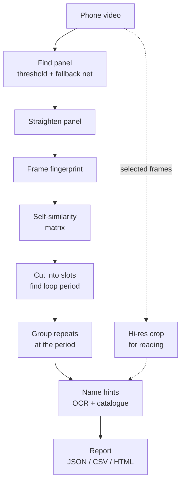
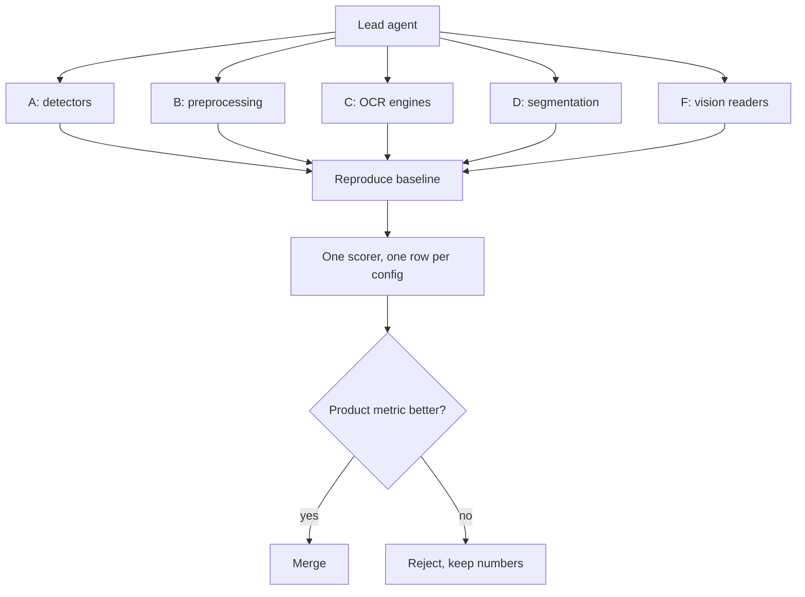

# Reklama Radar

Works out which advertisers ran on a roadside LED screen from a two-minute phone video.

**Aug 2026 · 173 commits · Python · TypeScript · code: private**
## The problem

An outdoor-advertising operator knows what plays on its own LED screens, but not on anyone else's. Its advertisers want exactly that: where competitors are placed, what runs next to them, and how it changes week to week. Today that means sending someone to stand at the screen and write it down.

Brand accuracy matters more than an exact play count: "shown 4 times instead of 5" is acceptable, but naming a brand that was not on screen is a failure. The original ad videos are not available to match against, so recognition relies on what is visible on the screen, plus a one-time human confirmation.

## What it does

- A field worker records an assigned screen in a Telegram Mini App for one to two playlist loops. A recording counts only if it was made in the app, near the screen and recently.
- The server finds the panel, straightens it, cuts the video into ad slots, groups repeats and reads on-screen text as naming hints.
- Output per recording: which advertisers appeared, when, with a confirmation frame for each.
- An unfamiliar ad is marked "unknown" rather than guessed. A person names it once, and the catalogue recognises it from then on.
- Reports by screen and by brand, with CSV export.

## How it works

In the field, uploads land in an SQLite-backed queue, and a separate worker runs the same pipeline as the command-line tool.

Research ran on a parallel experiment harness:

## Engineering notes

- **Parallel sweep harness.** Seven agents ran at once, each in its own git worktree, data directory and port. Each branch had to reproduce the baseline exactly, through the production code path, before its results counted. Most results were negative and are recorded: no alternative detector, preprocessing step, OCR engine or embedding beat the baseline.
- **Product metric over proxy metric.** One segmentation change raised boundary F1 from 0.72 to 0.81 but made brand names worse against two independent references, so it was rejected.
- **Small models where they win.** The frame fingerprint is a blurred 12×7 thumbnail; CLIP, DINOv2 and SigLIP all lost to it on "same picture or not". Panel detection is thresholding, with a trained network only as a fallback. CPU only: a two-minute recording takes about 5–6 s with OCR off.
- **Two crops per panel.** Features use a small blurred crop; reading re-crops from source resolution. That added 30.2 points of OCR hook recall, against 3.8 for plain upscaling.
- **Grouping by loop period.** Segments are compared only near the playlist period, so similar dark transitions from different advertisers don't merge.
- **Robust queue.** Workers claim jobs from an SQLite table with a conditional update. The API never imports the vision stack, and restarting it loses no jobs.
- **One contract.** OCR, local and hosted vision models answer the same task cards and are scored by one scorer.

## How it is verified

- **Locked metrics.** A regression test pins each quality metric 2 points below its measured value; a deliberately broken detection threshold was confirmed to trip it.
- **Blind hold-out.** Three new screens were labelled from raw frames, and the labels committed before the pipeline ran. Dev-set numbers did not carry over: wrong names rose from 71% to 82%, and the playlist period was found on 0 of 3 recordings, so play counts there are unreliable. Documented, with the cause.
- **Acceptance criteria, one command each:**

  | Criterion | Target | Measured |
  |---|---|---|
  | Brands found (recall) | ≥ 85% | 88.9% |
  | Named brands correct (precision) | ≥ 90% | 88.9%, borderline |
  | Processed without human help | ≥ 85% | 10 of 10 |
  | Time per recording | ≤ 5 min | 211 s worst case |
  | "Unknown" instead of a guess | holds | covered by tests |
  | Catalogue match precision | ≥ 90% | 100%, small sample |

  Recall and precision use a vision-model naming step on a small set (18 brands). The OCR-only path scores far lower, and run-to-run spread is about 5.6 points.
- **Journal checked against history.** A test requires every commit the work journal cites to exist, with a matching title.
- **CI:** ruff, pytest, an import check for every evaluation module, and ESLint, type check and build for the Mini App.

## Stack

Python 3.11 · OpenCV · NumPy / SciPy · scikit-learn · PyTorch (fallback detector, optional EasyOCR and RapidOCR) · FastAPI · SQLite · React 19 · Vite · TypeScript · Tailwind · Telegram Mini App · Cloudflare tunnel · GitHub Actions. In evaluation only: DINOv2, CLIP, SigLIP, YOLO-World, SAM 2, Tesseract, docTR, local vision models via Ollama, and hosted vision-model APIs.

## Screenshots

_The real code running on synthetic data. No client data appears anywhere._

*The pipeline's own HTML contact sheet after an offline run on a synthetic 140-second night video with invented ads: six ad slots found, each repeat grouped with its timecodes, and the brand field left empty for a person to confirm (the UI is in Russian, and OCR is off by default).*

*Two images the pipeline wrote from the same synthetic video: on the left, the LED panel found by the classic OpenCV detector and outlined in green; on the right, the frame-by-frame self-similarity matrix, whose repeating block pattern reveals the 68-second playlist loop.*

## Access

The code is private. To request a walkthrough or read access, open an issue in this repository or email eazamat360@gmail.com.
